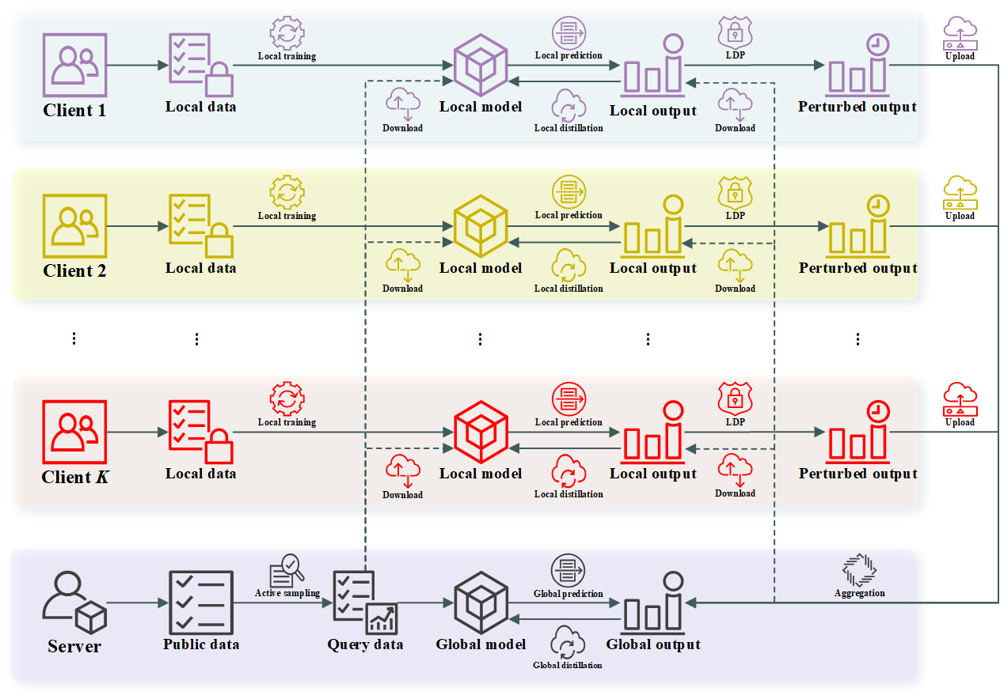

# FedLA

This repository contains an implementation with PyTorch for the paper "**Towards Privacy-Preserving and Communication-Efficient Federated Distillation**". The figure below illustrates an overview of the FedLA framework.



For more details about the technical details of FedLA, please refer to our paper.

**Installation**

Run command below to install the environment (using python3):

```
pip install -r requirements.txt
```

**Usage**

Run command below to run experiments on the homogeneous FL setting :

```
# CIFAR-10
python main.py \
  --algorithm FedLA \  # FedMD, FedMD-LDP, FedMD-NFDP, FedMD-DPSGD, FedLA
  --dataset cifar10 \
  --data_dir ./data \
  --partition dirichlet \
  --alpha 1 \  # 1, 0.1
  --batch_size 256
  --K 10 \
  --C 1 \
  --T 100 \
  --E_k 10 \
  --E 10 \
  --E2_k 10 \
  --lr_k 0.01 \
  --lr 0.01 \
  --N_query 20000 \
  --epsilon 5 \
  --global_model resnet50 \
  --local_models resnet50 \
  --output_dir ./runs
  
# CIFAR-100
python main.py \
  --algorithm FedLA \  # FedMD, FedMD-LDP, FedMD-NFDP, FedMD-DPSGD, FedLA
  --dataset cifar100 \
  --data_dir ./data \
  --partition dirichlet \
  --alpha 1 \  # 1, 0.1
  --batch_size 256
  --K 10 \
  --C 1 \
  --T 100 \
  --E_k 10 \
  --E 10 \
  --E2_k 10 \
  --lr_k 0.01 \
  --lr 0.01 \
  --N_query 20000 \
  --epsilon 5 \
  --global_model resnet50 \
  --local_models resnet50 \
  --output_dir ./runs
```

Run command below to run experiments on the heterogeneous FL setting :

```
# CIFAR-10
python main.py \
  --algorithm FedLA \  # FedMD, FedMD-LDP, FedMD-NFDP, FedMD-DPSGD, FedLA
  --dataset cifar10 \
  --data_dir ./data \
  --partition dirichlet \
  --alpha 1 \  # 1, 0.1
  --batch_size 256
  --K 10 \
  --C 1 \
  --T 100 \
  --E_k 10 \
  --E 10 \
  --E2_k 10 \
  --lr_k 0.01 \
  --lr 0.01 \
  --N_query 20000 \
  --epsilon 5 \
  --global_model resnet50 \
  --local_models resnet18,resnet18,resnet18,resnet34,resnet34,resnet34,resnet50,resnet50,resnet50,resnet50 \
  --output_dir ./runs
  
# CIFAR-100
python main.py \
  --algorithm FedLA \  # FedMD, FedMD-LDP, FedMD-NFDP, FedMD-DPSGD, FedLA
  --dataset cifar100 \
  --data_dir ./data \
  --partition dirichlet \
  --alpha 1 \  # 1, 0.1
  --batch_size 256
  --K 10 \
  --C 1 \
  --T 100 \
  --E_k 10 \
  --E 10 \
  --E2_k 10 \
  --lr_k 0.01 \
  --lr 0.01 \
  --N_query 20000 \
  --epsilon 5 \
  --global_model resnet50 \
  --local_models resnet18,resnet18,resnet18,resnet34,resnet34,resnet34,resnet50,resnet50,resnet50,resnet50 \
  --output_dir ./runs
```

